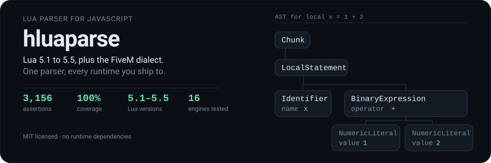

<p align="center">
  
</p>

A Lua parser written in JavaScript. Parses **Lua 5.1 through 5.5**, plus
**FiveM's dialect** — safe navigation, compound assignment, and non-English
identifiers.

No runtime dependencies. Ships TypeScript declarations. Runs in Node, browsers,
Rhino, Duktape, QuickJS and RingoJS.

## Install

Releases are published on GitHub, not npm.

```bash
git clone https://github.com/ItzDabbzz/hluaparse.git
cd hluaparse
npm install
```

Then `require` it:

```js
const hluaparse = require('./luaparse');

const ast = hluaparse.parse('i = 0');
```

In a browser the UMD build exposes two globals: `hluaparse`, and
`fivem-luaparse` as a compatibility alias for existing FiveM resources.

## Usage

```js
const ast = hluaparse.parse(code, options);
```

`parse` returns a plain JSON Abstract Syntax Tree.

### What it parses

`luaVersion` selects the dialect. This table is the **measured behaviour of
this parser**, not documentation of intent — every cell was produced by
parsing the construct and recording whether it succeeded.

| Feature | 5.1 | 5.2 | 5.3 | 5.4 | 5.5 | FiveM5.4 | LuaJIT |
| --- | :-: | :-: | :-: | :-: | :-: | :-: | :-: |
| `goto` / labels | | ✅ | ✅ | ✅ | ✅ | ✅ | ✅ |
| Hex float fractions | | ✅ | ✅ | ✅ | ✅ | ✅ | ✅ |
| `continue` | | ✅ | ✅ | ✅ | ✅ | ✅ | ✅ |
| C-style comments `--[[ ]]` | ✅ | ✅ | ✅ | ✅ | ✅ | ✅ | ✅ |
| Bitwise `&` | | | ✅ | ✅ | ✅ | ✅ | |
| Integer division `//` | | | ✅ | ✅ | ✅ | ✅ | |
| Local attributes `<const>` | | | | ✅ | ✅ | ✅ | |
| `global` declarations | | | | | ✅ | | |
| Named varargs `...args` | | | | | ✅ | | |
| Compound assignment `+=` | | | | | | ✅ | |
| Safe navigation `?.` | | | | | | ✅ | |
| Non-English identifiers | | | | | | ✅ | |

The default is **Lua 5.5**, the newest supported release. Pass an explicit
`luaVersion` to target something else — stock `5.1` through `5.4` are all
available and all reject anything the real compiler rejects.

`FiveM5.4` is a deliberate divergence, kept available but no longer the
default. Under it:

- **Non-English identifiers are accepted.** `local имя = 1` parses. Stock Lua
  rejects this in every version, which is why it lives behind its own option.
- **FiveM syntax is accepted.** Safe navigation (`?.`) and compound assignment
  (`+=`) are extensions, and its runtime allows them, so the parser matches.

Under the stock profiles those constructs are rejected rather than silently
allowed, so a mistake surfaces instead of shipping. FiveM is an opt-in now, not
something you have to opt out of.

## The AST

Every node follows one rule: the type name, then that node's own fields. Child
nodes are always real child nodes, never folded into a caption. For
`local x = 1 + 2` you get:

```js
{
  "type": "Chunk",
  "body": [
    { "type": "LocalStatement",
      "variables": [ { "type": "Identifier", "name": "x" } ],
      "init": [ { "type": "BinaryExpression", "operator": "+",
                  "left":  { "type": "NumericLiteral", "value": 1, "raw": "1" },
                  "right": { "type": "NumericLiteral", "value": 2, "raw": "2" } } ] }
  ],
  "comments": []
}
```

Drop the `local` and the same expression becomes an `AssignmentStatement`
instead, with `variables` and `init` in the same shape.

`luaparse.ast` holds every constructor, so you can rewrite node creation to
reshape the tree. The `onCreateNode` callback is the supported way to observe it.

## Options

| Option | Default | Meaning |
| --- | --- | --- |
| `luaVersion` | `'5.5'` | `'5.1'` `'5.2'` `'5.3'` `'5.4'` `'5.5'` `'FiveM5.4'` `'LuaJIT'` |
| `wait` | `false` | Signal end of input yourself, via the returned parser object |
| `comments` | `true` | Collect comments into `chunk.comments` |
| `scope` | `false` | Track identifier scopes and `isLocal` |
| `locations` | `false` | Attach `loc` to each node |
| `ranges` | `false` | Attach `range` to each node |
| `extendedIdentifiers` | FiveM only | Allow code points ≥ U+0080 in identifiers |
| `encodingMode` | `'none'` | `'none'` `'pseudo-latin1'` `'x-user-defined'` |
| `onCreateNode` | `null` | Called with each completed node |
| `onCreateScope` | `null` | Called when a scope opens |
| `onDestroyScope` | `null` | Called when a scope closes |
| `onLocalDeclaration` | `null` | Called with each declared local identifier |

Defaults are also on `hluaparse.defaultOptions` if you want to change them
globally.

### Encoding modes

Lua strings are byte strings, and Lua implementations read source as octets.
The parser's input is a JavaScript string, so something has to bridge the two.

- `'none'` — pass everything through untouched. String literals parse to
  `null`. This is the default.
- `'pseudo-latin1'` — source decoded as `iso-8859-1`, byte escapes mapped to
  U+0080–U+00FF. Not the WHATWG `iso-8859-1`, which is `windows-1252`.
- `'x-user-defined'` — source decoded as WHATWG `x-user-defined`, byte escapes
  mapped to U+F780–U+F7FF.

## Lexer

The lexer is usable on its own. Each token carries a `type` (match against
`hluaparse.tokenTypes`), a `value`, `line`, `lineStart`, and a `range` you can
use to slice the raw text back out of the source.

```js
const parser = hluaparse.parse('foo = "bar"', { wait: true });
parser.lex(); // { type: 8,  value: 'foo', line: 1, lineStart: 0, range: [0, 3] }
parser.lex(); // { type: 32, value: '=',  line: 1, lineStart: 0, range: [4, 5] }
parser.lex(); // { type: 2,  value: null, line: 1, lineStart: 0, range: [6, 11] }
```

The `StringLiteral` value is `null` under the default `encodingMode: 'none'`,
because the bytes are never interpreted. Pass `encodingMode: 'pseudo-latin1'`
and that third token becomes `value: 'bar'`. Use `range` to slice the raw
source text when you need the bytes exactly as written.

## Command line

```bash
$ node bin/luaparse "i = 0"
{"type":"Chunk","body":[],"comments":[]}
{"type":"Chunk","body":[{"type":"AssignmentStatement","variables":[{"type":"Identifier","name":"i"}],"init":[{"type":"NumericLiteral","value":0,"raw":"0"}]}],"comments":[]}
```

One JSON line per input, so that is two: the empty first line is the implicit
end-of-input marker, and the second is the parse result.

`-c/--code` for a snippet, `-f/--file` for a file, `-b/--beautify` to indent the
output, `-q/--quiet` to suppress it.

## Correctness

The suite is **3,156 assertions** and CI enforces **100% statement, branch,
function and line coverage**. Every run is also validated as well-formed TAP,
and a run that produces no TAP at all is treated as a failure rather than a
pass — an engine that crashes on load cannot report success.

Tests run on 15 engine configurations:

| Engine | Versions |
| --- | --- |
| Node.js | 20, 22, 24 |
| Bun | 1.3.13, latest |
| Rhino | 1.9.1 |
| RingoJS | 4.0.0 |
| Duktape | 2.4.0, 2.5.0, 2.6.0, 2.7.0 |
| QuickJS | 2020-09-06, 2025-04-26, 2025-09-13, 2026-06-04 |

Node 20 is the oldest supported Node line; earlier ones are all end-of-life and
no longer tested. The oldest Duktape and QuickJS builds are kept deliberately —
they are the floor for the embedded engines this parser is most often dropped
into.

`luaparse.js` is modern ES6, which those older embeddable engines cannot parse.
`dist/luaparse.es5.js` is a downlevelled build generated from it
(`npm run build-es5`), and CI runs the ES5-only engines against that instead.
It is generated, never hand-edited, and behaves identically — both files pass
the full suite.

Beyond its own suite, releases are checked differentially against real Lua
compilers: a corpus of 548 constructs is parsed by both `hluaparse` and `luac`,
and any disagreement on accept-or-reject is a bug. That process is how the Lua
5.1 hex-float bug was found — `0xA.8p0` was accepted under 5.1, where real
`luac 5.1.5` rejects it.

Lua 5.5 is a draft. No official compiler exists to diff against, so it is
verified against the 5.5 manual only.

## Development

```bash
npm install
make qa
```

`make qa` runs the tests, the linter, complexity analysis and the coverage gate.
On Windows, invoke each target's command through `bash` — `make` drives
`cmd.exe`, which cannot run the extensionless scripts in `node_modules/.bin`.

Coverage reports are published with each run and land on the project's
`gh-pages` branch.

## Differences from upstream luaparse

Originally written by Oskar Schöldström for his bachelor's thesis at Arcada,
and maintained here with FiveM support, Lua 5.5, and the coverage and
differential work described above.

- Lua 5.5: `global` declarations, named varargs, and `local` attributes
  everywhere they apply.
- `FiveM5.4`: safe navigation, compound assignment, extended identifiers.
- Hex float fractions are correctly rejected on 5.1, where upstream accepts them.
- Unreachable code paths were removed rather than excluded from coverage.

The default is `5.5` here, where upstream defaults to `5.1`. Pass an explicit
`luaVersion` if you need to pin behaviour.

## Credits

Much of the original code derives from [LuaMinify][luaminify], the [Lua][lua]
source, and [Esprima][esprima].

## License

MIT

[luaminify]: https://github.com/stravant/LuaMinify
[lua]: https://www.lua.org
[esprima]: https://esprima.org
